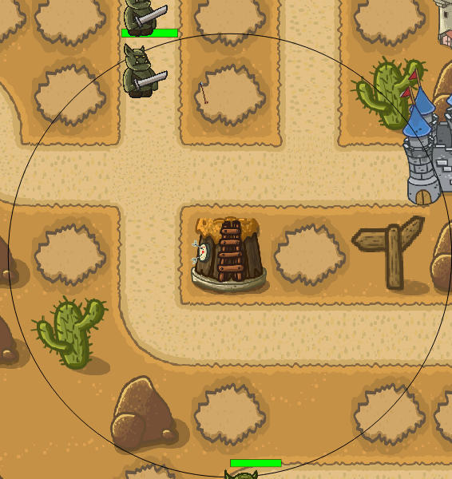
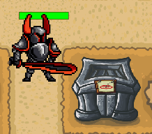

# TowerDefense
2D игра жанра Tower Defense написанная с использованием библиотек Qt. Все исходные файлы и .exe файл на https://drive.google.com/file/d/1LUbVG9EmGFbpX4sS1kyXx7eIHNJy4wir/view
## Меню
Программа генерирует уровни из папки levels. В файле можно задать окружение, структуру уровня, число волн, размер волны, её "наполнение" и начальные значения ресурсов. 
При запуске игры пользователя встречает меню выборауровней с окном предпросмотра.

## Игровой процесс
В игре существуют различные башни для защиты замка от наступающих волн противников.

Башни можно улучшать за внутриигровой ресурс - золото. Таким образом они будут быстрее и дальше стрелять, наносить больше урона и так далее. Причём их текстура также будет улучшаться
К примеру башня лучников, которая стреляет по дуге (параболе).

Башня поддержки, которая призывает дружественного неигрового персонажа, который будет вступать в ближний бой с противниками, таким образом останавливая их.

